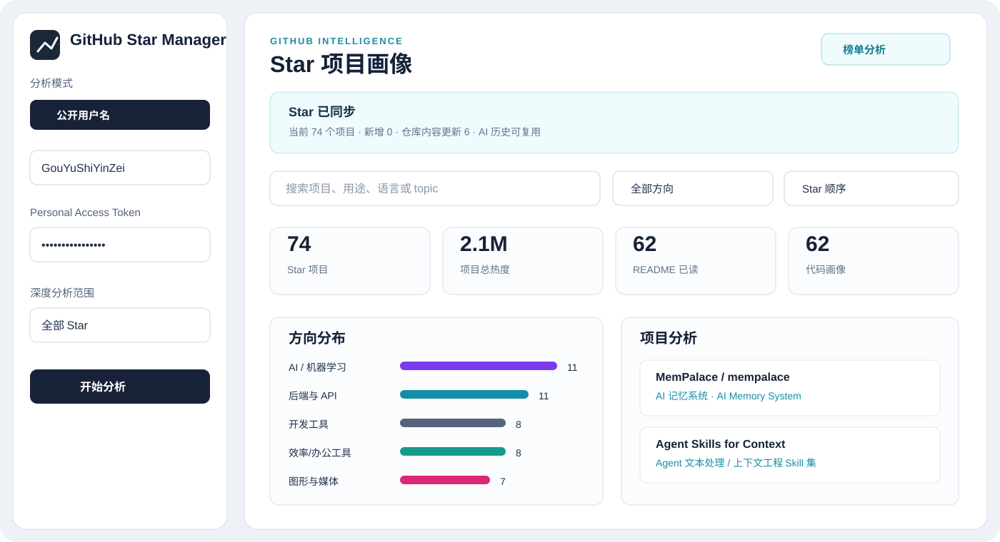

# GitHub Star Manager

> 把一页页 Star，变成真正读得懂的项目地图。

GitHub Star Manager 是一个本地优先的 GitHub Star 分析器。输入 GitHub 用户名，应用会同步 Star 列表，读取 README、仓库目录、语言分布和关键配置文件，给出项目用途、技术栈、代码结构、使用方式和中英文摘要。可选接入兼容 OpenAI Chat Completions 的 AI 服务，对规则分析结果做更贴近 README 和代码事实的二次总结。



## 亮点

- **读懂 Star 列表**：公开用户名模式可分析任意用户的公开 Star；Token 模式可读取当前账号有权限访问的 Star。
- **README + 代码画像**：结合 README、目录结构、语言占比、关键配置文件和可识别的启动命令，减少只看仓库标题造成的误判。
- **中文优先，英文可读**：中文结论负责解释项目是什么、解决什么问题；English 区块保持纯英文，避免中英混杂。
- **AI 精准分析**：支持自定义 API Key 与 Base URL；结果会保存到浏览器历史，仓库未更新时优先复用，不重复消耗额度。
- **榜单分析**：读取 Star History 周榜和总榜，可对榜单项目做批量 AI 分析。
- **同步与筛选**：同步新增、移除和仓库内容更新，支持方向、来源、语言、热度和搜索筛选。
- **历史备份**：历史页支持导出 JSON、导入合并和搜索完整分析结果，备份不包含 API Key 或 Token。
- **桌面安装包**：基于 Tauri 2 打包 Windows MSI/NSIS 安装程序，使用系统 WebView2，不捆绑 Python 或完整 Chromium。

## 技术架构

```text
React + TypeScript + Vite
        ├── 网页版：Vite preview / Nginx
        └── 桌面版：Tauri 2 + 系统 WebView2
```

网页版开发环境使用 Vite 代理处理 AI 和 Star History 数据；Tauri 桌面版通过 `tauri-plugin-http` 直接访问 GitHub、Star History 和用户配置的 AI 服务。所有分析缓存、用户名和可选 Token 默认保存在当前浏览器或桌面 WebView 的本地存储中。

## 本地开发

环境要求：Node.js 20+。桌面打包另外需要 Rust stable、Visual Studio C++ Build Tools 和 WebView2 Runtime。

```bash
npm install
npm run dev
```

打开 `http://127.0.0.1:5173/`。

可选地复制 `.env.example` 为 `.env.local`，填入本地测试用的 AI 服务配置：

```text
DEEPSEEK_API_KEY=your-key
DEEPSEEK_BASE_URL=https://api.deepseek.com
DEEPSEEK_MODEL=deepseek-v4-pro
```

也可以直接在页面的“AI 服务设置”中填写 Key 和 Base URL。真实密钥只放在本机 `.env.local` 或浏览器本地存储中，**不要提交到 Git**。

## 构建与打包

构建网页版静态资源：

```bash
npm run build
npm run preview -- --host 0.0.0.0 --port 4173
```

仓库内的 `deploy/` 目录包含 systemd 和 Nginx 配置示例，适合把网页版挂到已有 HTTPS 站点的子路径。

启动桌面开发窗口：

```bash
npm run tauri:dev
```

生成 Windows 安装包：

```bash
npm run tauri:build
```

生成文件位于：

```text
src-tauri/target/release/bundle/msi/GitHub Star Manager_0.1.1_x64_en-US.msi
src-tauri/target/release/bundle/nsis/GitHub Star Manager_0.1.1_x64-setup.exe
```

## 历史备份与恢复

打开侧栏的「AI 历史」，在完整历史页右上角导出 JSON 备份；在另一浏览器或安装版的同一页面导入即可合并。同一记录保留较新的分析，不覆盖其他历史。当前最多保留 500 条 AI 记录，导入超限或格式错误会提示，不会清空原记录。

历史保存在当前网站地址对应的浏览器本地存储中，不是服务器数据库。更换域名、浏览器或设备不会自动同步；清除网站数据前请先导出。备份虽不包含认证密钥，仍可能包含私有仓库名称和分析内容，请妥善保管。

同步时，单纯的 Star 数量和 `updated_at` 变化不再触发重复 AI 分析；仓库代码推送、描述或主题等分析依据变化仍会重新分析。旧 AI 历史继续复用，新版规则会在重新分析后生效，不会批量重写已保存结果。

## 回归测试

```bash
npm test
npm run build
```

测试覆盖规则误判、AI 返回格式校验、缓存兼容与历史备份合并，使用本地样例，不调用付费 AI。通过测试不代表任意仓库都能准确识别。

## 数据与隐私

- GitHub 数据来自 GitHub REST API。未填写 Token 时受 GitHub 未认证请求速率限制影响。
- README、代码画像、AI 分析历史、用户名和可选 Token 的保存位置是本机浏览器 localStorage；应用不会把这些内容写入公开仓库。
- AI 分析只会把当前项目的仓库元数据、README 摘要和代码画像发送到你配置的 AI Base URL。使用第三方服务前请确认其隐私政策。
- 本项目仓库不包含任何 API Key、Personal Access Token、服务器密码或部署私钥。

## 当前边界

代码画像默认读取仓库文件树和少量关键配置文件，不会克隆整个仓库，也不会执行仓库代码。因此它适合快速理解和筛选 Star，不能替代完整代码审计。AI 结果会引用已有证据，但仍应以项目 README、源码和 Release 为最终依据。

## License

暂未指定。使用本项目时请同时遵守 GitHub API、Star History 以及各个被分析仓库的许可证要求。
